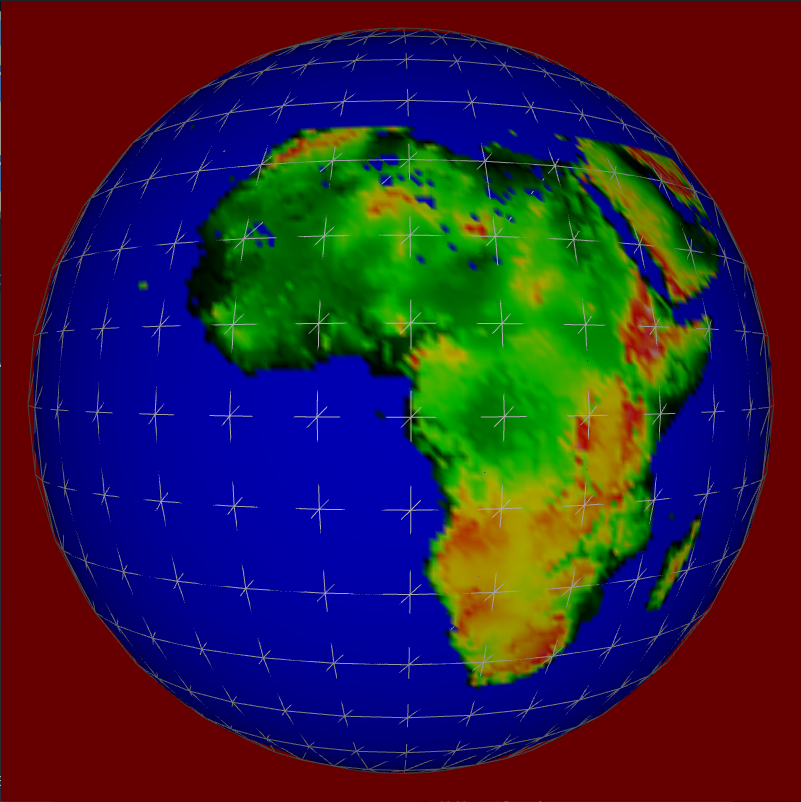
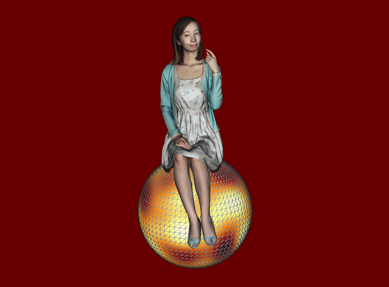
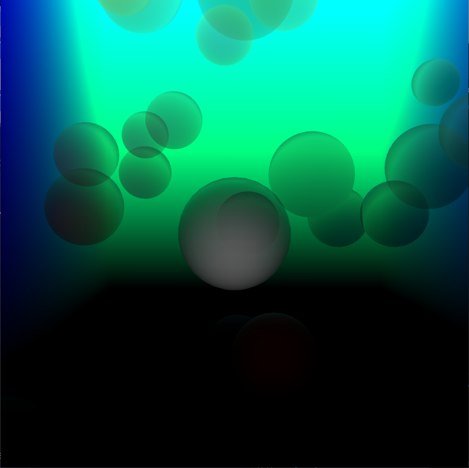
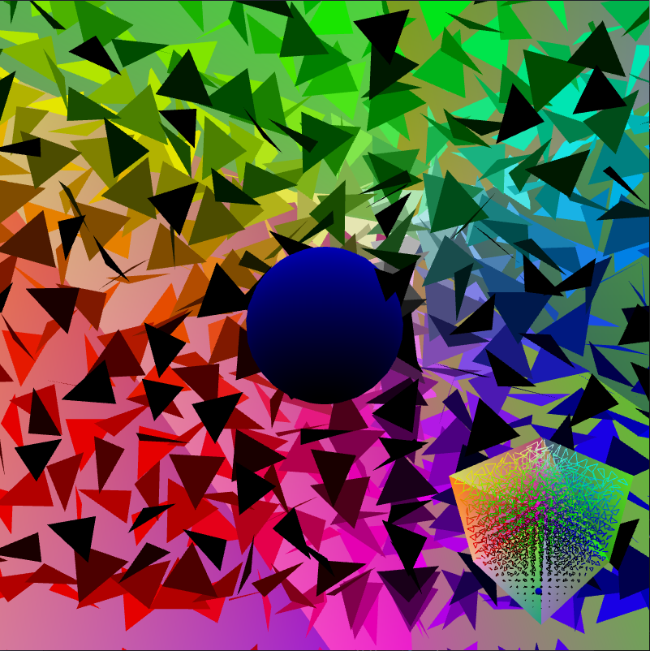
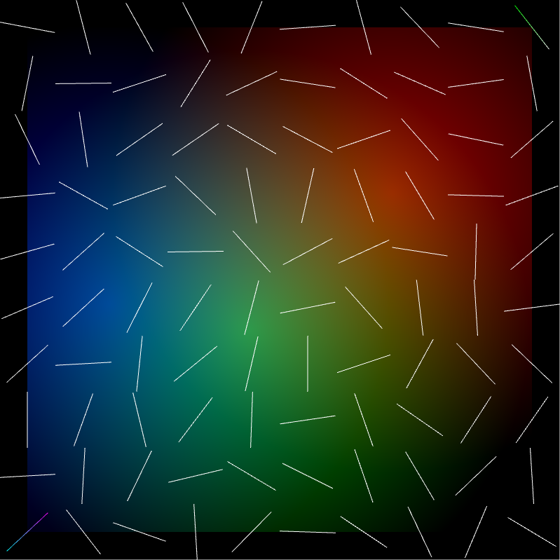

# OpenGL-models

Programs in this reposity are assignments for "basics of computer graphics" classes

### Reposity contains 5 examples

3. Maze - simple 2D game were you need to reach the goal, while avoiding other lines  
4. Maze 3D - Test for MVP and 3d controls  
5. Bubbles - Simple game were you need to   reach other side of map, in order to advance to the next level. It implements phong and beer's lighting  
6. Earth - Level of detail model of earth, using data from saltelite, that need to be stored loacly on computer  
7. Texturing - Test for object loading and texturing and perlin noise  

### Images

